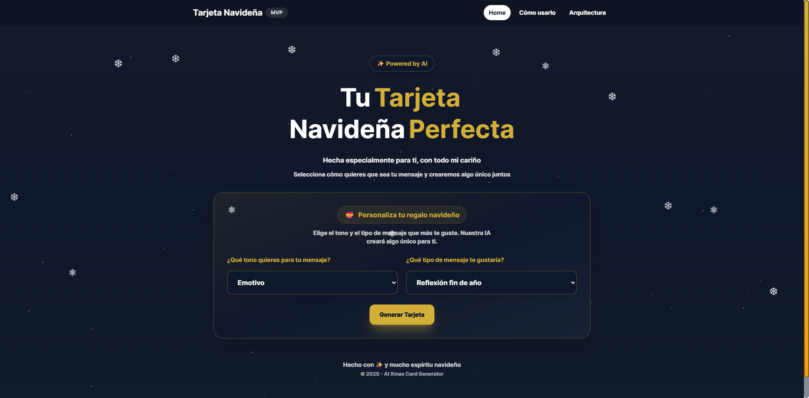
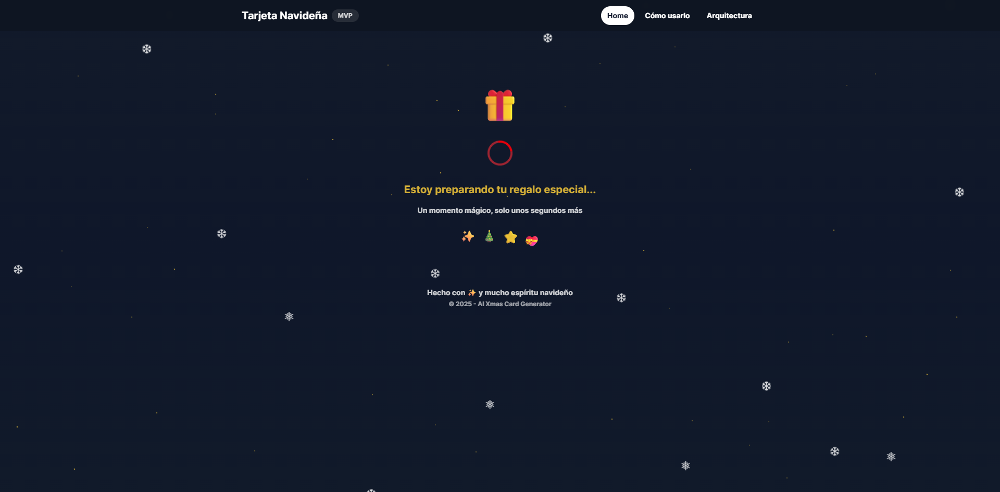
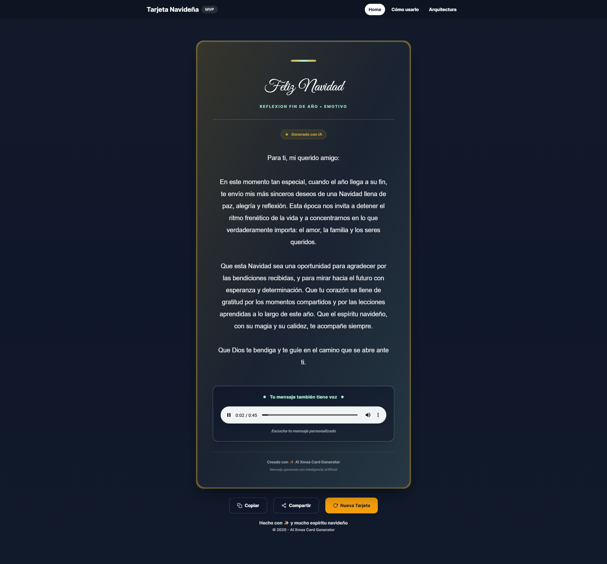
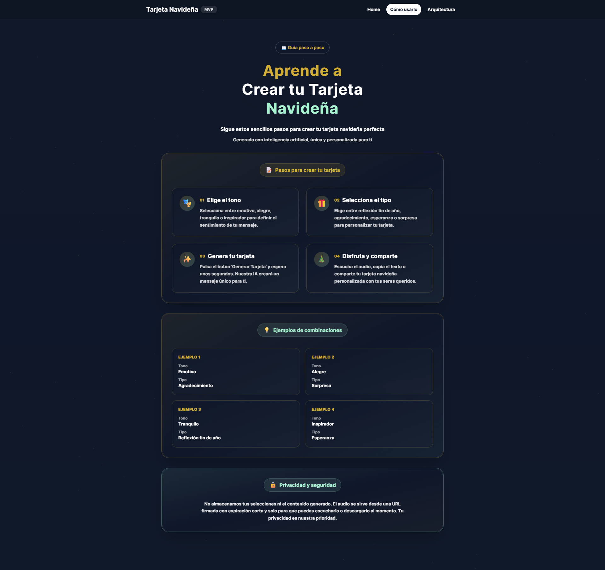
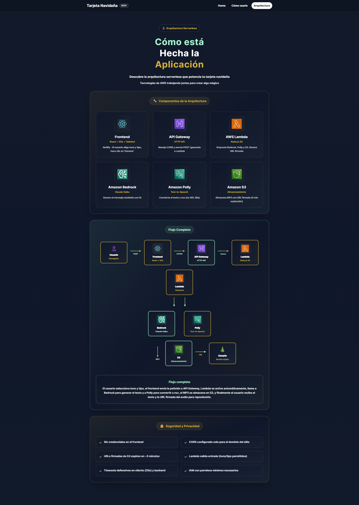

# Generador de Tarjetas Navideñas con IA

**Generador de Tarjetas Navideñas con IA** es una aplicación web interactiva desarrollada para crear tarjetas navideñas personalizadas utilizando inteligencia artificial. Este proyecto utiliza React, Vite y servicios de AWS (Bedrock, Polly, S3) para generar mensajes navideños únicos con texto y audio personalizados.

## Capturas de pantalla

### Página principal



### Loading


### Tarjeta generada



### Cómo usarlo



### Arquitectura del sistema



## Funcionalidades

- **Generación de mensajes con IA:** Utiliza Amazon Bedrock (Claude Haiku) para crear mensajes navideños personalizados según el tono y tipo seleccionado.
- **Text-to-Speech:** Convierte el mensaje generado a audio usando Amazon Polly con voz en español mexicano (Mia).
- **Personalización:** Permite elegir entre diferentes tonos (emotivo, alegre, tranquilo, inspirador) y tipos de mensaje (reflexión fin de año, agradecimiento, esperanza, sorpresa).
- **Música de fondo:** Reproduce música navideña mientras se visualiza la tarjeta generada.
- **Diseño responsivo:** Adaptado para verse perfectamente en dispositivos móviles, tablets y escritorio.

## Características destacadas

- **Arquitectura serverless:** Implementada completamente en AWS sin servidores tradicionales.
- **Interfaz moderna:** Diseño elegante con efectos visuales, animaciones y tema navideño.
- **Audio personalizado:** Cada tarjeta incluye un audio único generado con IA.
- **URLs firmadas:** Los archivos de audio se almacenan en S3 con URLs firmadas que expiran en 5 minutos para mayor seguridad.
- **CORS configurado:** Seguridad implementada con CORS restringido al dominio del sitio.

## Tecnologías utilizadas

### Frontend

- **React 19:** Biblioteca para construir interfaces de usuario.
- **Vite:** Herramienta de construcción rápida y moderna.
- **Tailwind CSS:** Framework de CSS utility-first para diseño responsivo.
- **React Router:** Navegación entre páginas de la aplicación.

### Backend (AWS)

- **API Gateway:** Punto de entrada HTTP para la API.
- **AWS Lambda:** Función serverless que orquesta el proceso.
- **Amazon Bedrock:** Servicio de IA para generar mensajes (Claude Haiku).
- **Amazon Polly:** Servicio de text-to-speech para convertir texto a voz.
- **Amazon S3:** Almacenamiento de archivos de audio.

## Herramientas utilizadas

- [React](https://react.dev/)
- [Vite](https://vitejs.dev/)
- [Tailwind CSS](https://tailwindcss.com/)
- [React Router](https://reactrouter.com/)
- [AWS Bedrock](https://aws.amazon.com/bedrock/)
- [Amazon Polly](https://aws.amazon.com/polly/)
- [Amazon S3](https://aws.amazon.com/s3/)
- [AWS Lambda](https://aws.amazon.com/lambda/)
- [API Gateway](https://aws.amazon.com/api-gateway/)

## Implementación

### Requisitos

1. Node.js 18 o superior.
2. Navegador moderno compatible con React.
3. Cuenta de AWS con permisos para:
   - AWS Lambda
   - Amazon Bedrock (acceso a Claude Haiku)
   - Amazon Polly
   - Amazon S3
   - API Gateway

### Instalación

1. Clonar el repositorio:

```bash
git clone https://github.com/marcosd59/ai-xmas-card-generator.git
cd ai-xmas-card-generator
```

2. Instalar dependencias:

```bash
npm install
```

3. Configurar variables de entorno:

   - Crear un archivo `.env` con la URL de tu API Gateway:

   ```
   VITE_API_URL=https://tu-api-gateway-url.execute-api.region.amazonaws.com
   ```

4. Ejecutar en modo desarrollo:

```bash
npm run dev
```

5. Construir para producción:

```bash
npm run build
```

### Configuración de AWS

El backend requiere la configuración de:

- Una función Lambda que procese las peticiones
- Un API Gateway HTTP API configurado con CORS
- Permisos IAM para acceder a Bedrock, Polly y S3
- Un bucket de S3 para almacenar los archivos de audio

## Estructura del proyecto

```
ai-xmas-card-generator/
├── src/
│   ├── assets/
│   │   └── images/          # Imágenes y capturas de pantalla
│   ├── components/          # Componentes reutilizables
│   ├── pages/               # Páginas de la aplicación
│   │   ├── Home.jsx         # Página principal
│   │   ├── Architecture.jsx # Diagrama de arquitectura
│   │   └── HowTo.jsx        # Instrucciones de uso
│   ├── api/                 # Lógica de API
│   └── App.jsx              # Componente principal
├── public/                  # Archivos estáticos
└── package.json
```

## Licencia

Este proyecto está bajo la Licencia MIT. Mira el archivo [LICENSE](LICENSE) para más detalles.

## Contacto

Si tienes alguna pregunta o sugerencia, no dudes en abrir un issue o contactar al desarrollador:

- **Nombre:** Marcos Pool
- **Correo electrónico:** <damian.marcospool@gmail.com>
- **GitHub:** [marcosd59](https://github.com/marcosd59)
